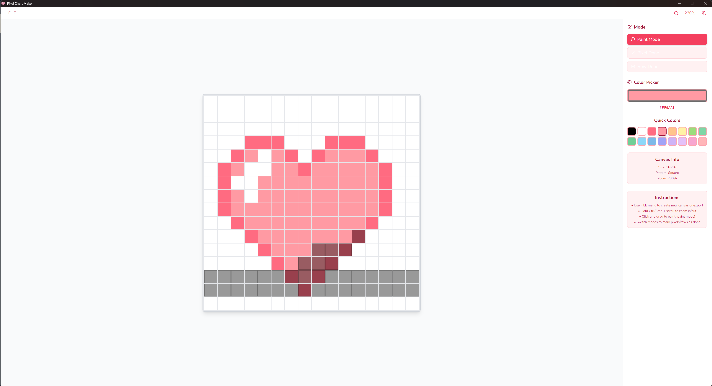

# Pixel Chart Maker Desktop App

A desktop pixel chart maker built with React, Vite, and Electron.

A simple and user-friendly tool designed primarily for creating pixel charts for crafts such as cross-stitch, crochet, knitting, and perler beads. Customize grid sizes and patterns, pick colors, and easily design your own charts.



## Features

- **Multiple Grid Sizes**: 8x8, 16x16, 24x24, 32x32, and Custom
- **Grid Patterns**: Square grid, horizontal brick pattern, vertical brick pattern
- **Drawing Modes**: Click to paint, drag to draw continuously
- **Export**: Download your artwork as PNG files


- **Grid Sizes**: Preset grid sizes plus option for custom dimensions
- **Grid patterns**: Square grid, horizontal brick, and vertical brick
- **Color Tools**: Color picker and predefined color palette
- **Drawing Modes**: Click to paint, drag to draw continuously
- **Track Progress**: Mark pixels or entire rows as complete
- **Save & Load Projects**: Export your charts and load them later to continue where you left off


## Installation

1. Clone the repository:
```bash
git clone https://github.com/karolinaoren/pixel-chart-maker.git
cd pixel-chart-maker
```

2. Install dependencies:
```bash
npm install
```

## Development

### Run in development mode:
```bash
npm run electron:dev
```

This will start both the Vite dev server and Electron in development mode with hot reloading.

### Run web version only:
```bash
npm run dev
```

## Building

### Build for production:
```bash
npm run electron:build
```

This will:
1. Build the React app
2. Build the Electron main process
3. Package the app for current platform

### Build for distribution:
```bash
npm run build
```

This will create installers/packages in the `release` folder for your platform.

## Project Structure

```
pixel-chart-maker/
├── electron/
│   ├── main.js          
│   └── preload.js       
├── src/
│   ├── App.jsx         
│   ├── main.jsx        
│   └── index.css        
├── assets/
│   ├── heart-icon.svg         
│   └── heart-icon.png         
├── scripts/
│   └── build-electron.js 
├── package.json
├── vite.config.js      
├── vite.electron.config.js
└── README.md
```

## Technologies Used

- **React 18** - UI framework
- **Vite** - Build tool and dev server
- **Electron** - Desktop app framework
- **Tailwind CSS** - Styling
- **Lucide React** - Icons

